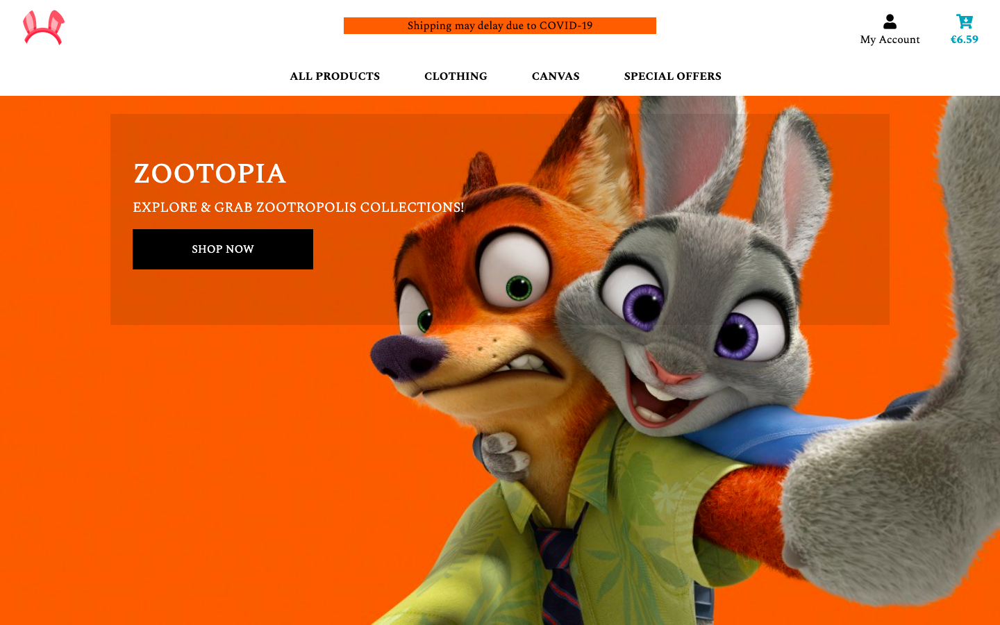
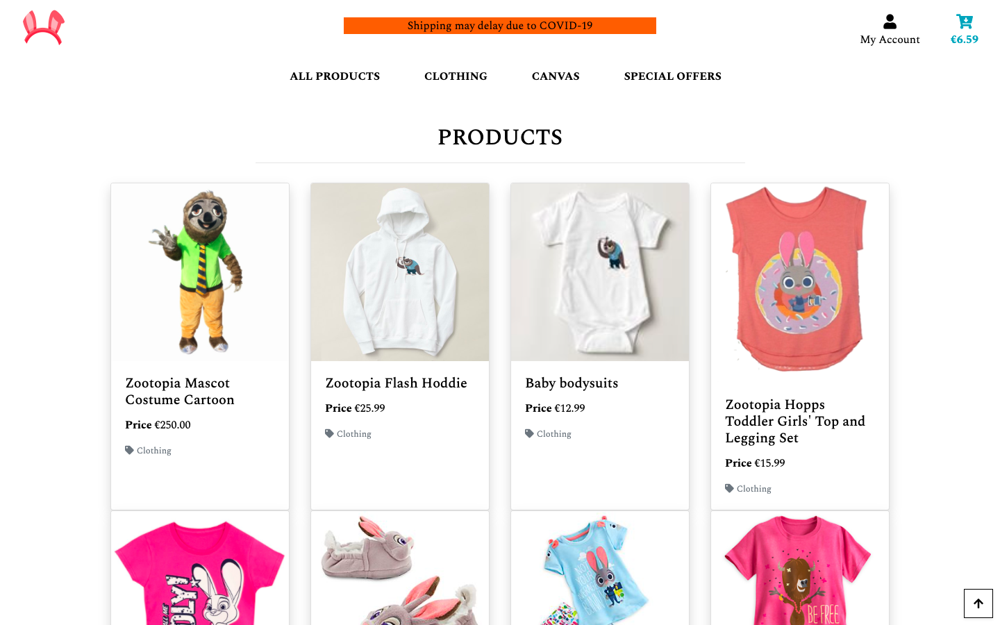
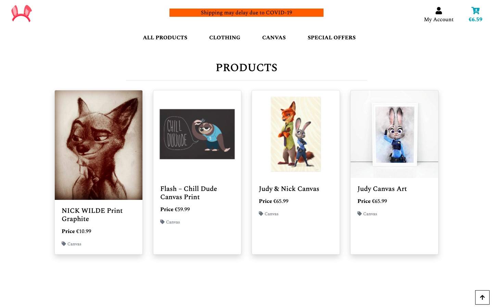
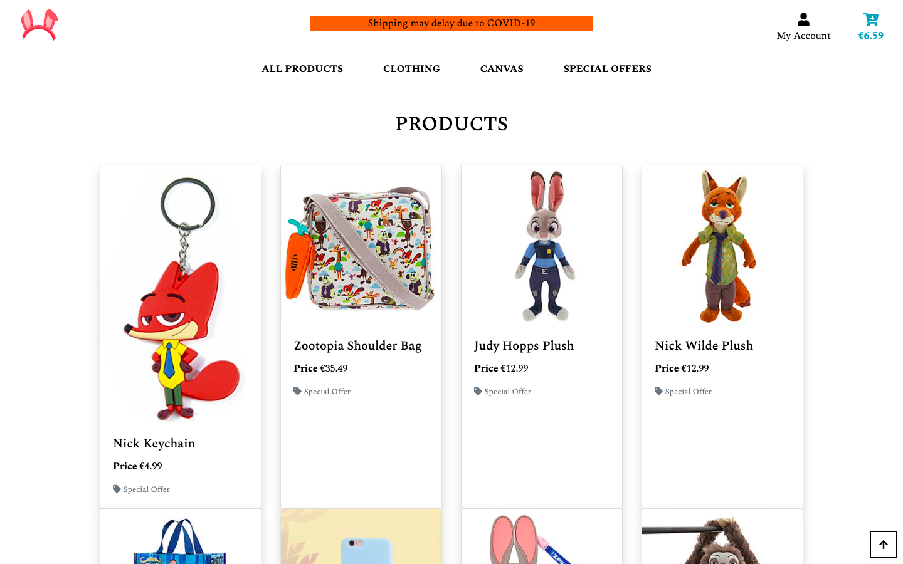
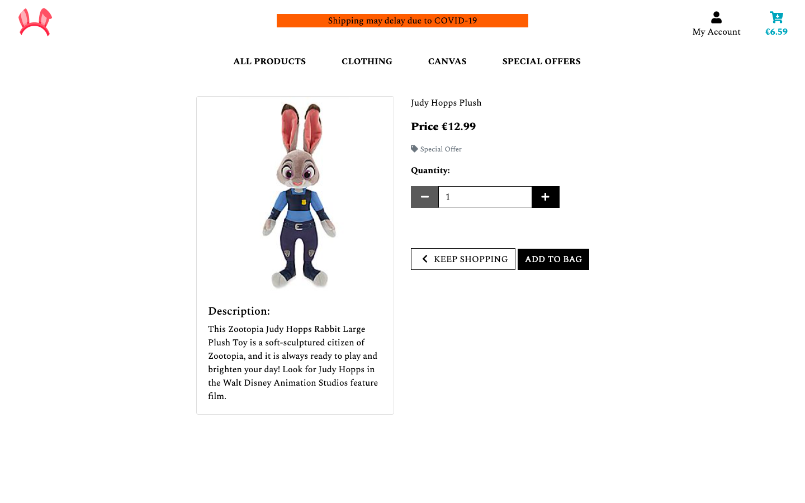
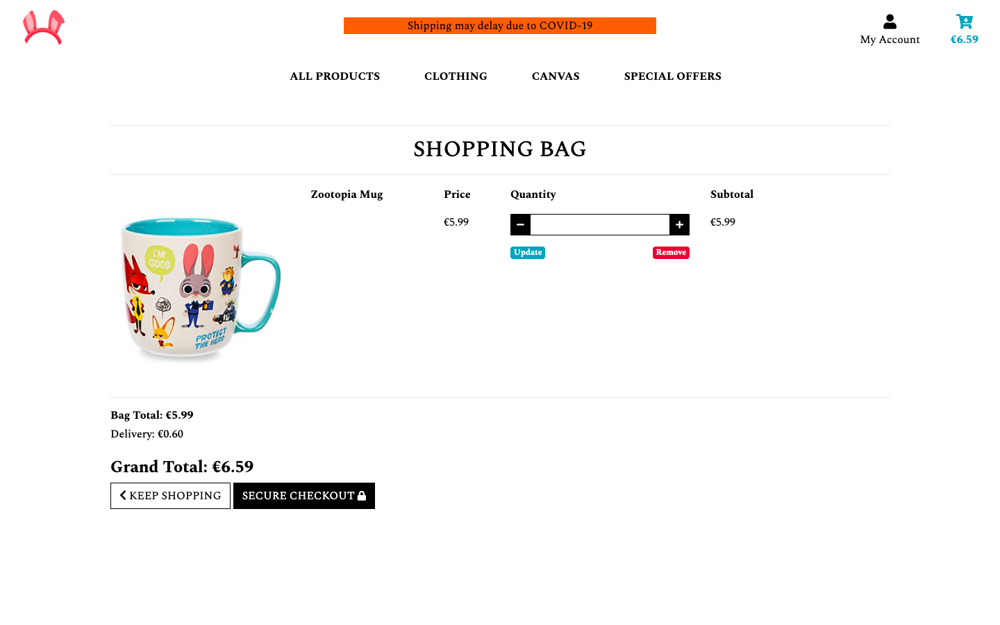
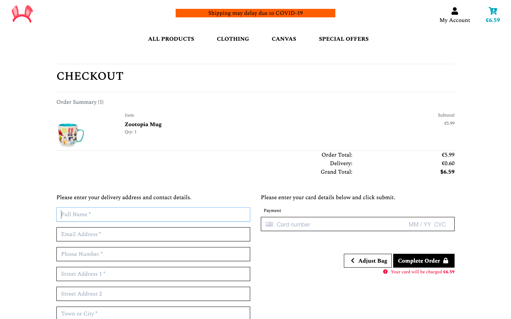
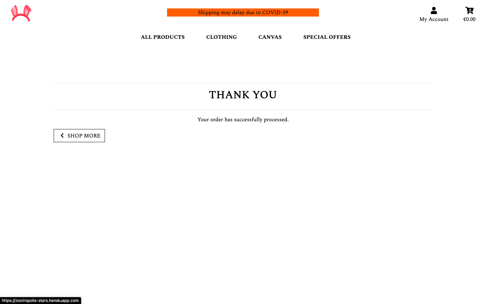
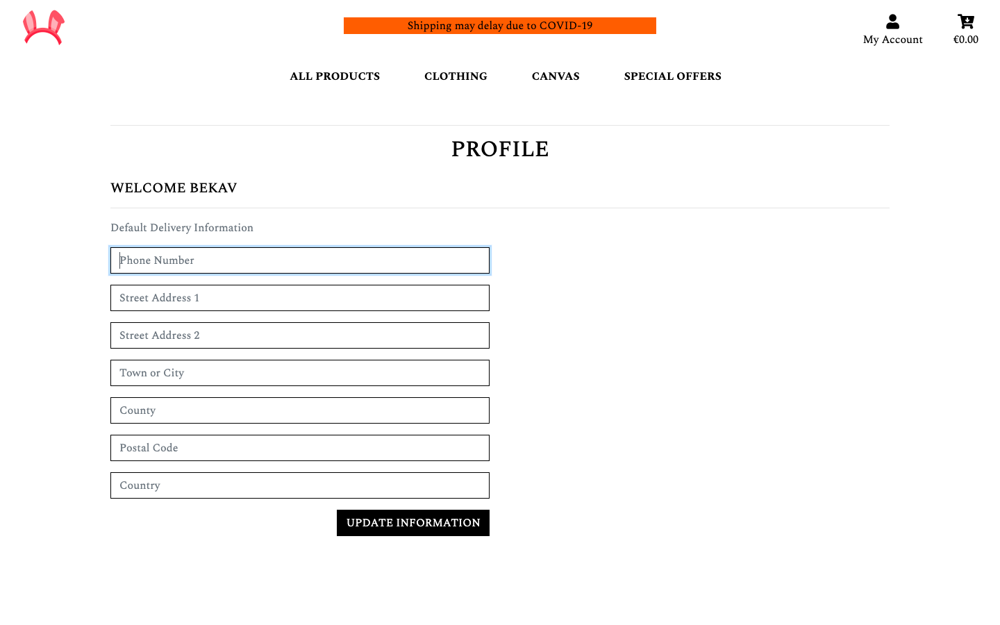

## Zootropolis Stars
---


### Milestone Project - Full Stack Frameworks with Django
---
Zootropolis stars is an e-commerce website aimed at fans of the amazing super hot Zootopia characters. Through it, the fans can purchase goods that replicate items that exist whithin the world of Disney, Zootopia movies and games like Zootopia Crime Files.

The Zootopia copyrights is held by Disney. No copyrights infringement is intended with this ecommerce website, it's created for educational purposes only, and no money is being made through the Zootrolopis Stars website.

The project utalizes Python 3, Django 3.0.7, JavaScript and various other Frameworks and libraries. Full CRUD functionality is offered throughout features of the project.


### Project Purpose
---
Zootopia is defiantly one of those amazing Disney movies that I could easily rewatch over and over again. 

The underlying mystery of these animals becoming like animals is an interesting concept to see from their perspective. 

Fans of Zootopia like myself wildy wants to collect and archive the super hot characters merchs. If you looking to have new collectives your on the right place. Vamos...


#### [See here for a deployed app](https://zootropolis-stars.herokuapp.com/)

#### [See here for the high fidelity wireframe](https://c79emn.axshare.com/)
---
High fidelity prototype is created in Axure, as this helped me design better.


### Quick Quide**
---
###### HOME
The home page features a very special hero image of the Zootopia Stars and a nice bootstrap jumotron rgba opacity background colour with a large SHOP NOW button.

<details>
<summary>See here for the Home Page</summary>

<p align="center">
    
</p>
</details>


###### ALL PRODUCTS
The all products page is a filtered products which is exist on the site. This can be accessed by clicking the ALL PRODUCTS label on the navigation bar and as well as the SHOP NOW button on the home page.

<details>
<summary>See here for the All Product Page</summary>

<p align="center">
    
</p>
</details>


###### CLOTHING
The clothing label filters only the clothing products which exist in the database. This can be accessed by clicking on the clothing label on the navigation bar.

<details>
<summary>See here for the Clothing Page</summary>

<p align="center">
    
</p>
</details>


###### CANVAS
The canvas label filters only the canvas and prints products of the Zootopia which exist in the database. This can be accessed by clicking on the canvas label on the navigation bar. 

<details>
<summary>See here for the Canvas Page</summary>

<p align="center">
    
</p>
</details>


###### SPECIAL OFFER
The special offer label filters only the products which are on special offer that can be only added by the superuser on the admin page. This can be accessed by clicking on the special offer label on the navigation bar.

<details>
<summary>See here for the Special Offer Page</summary>

<p align="center">
    
</p>
</details>


***NOTE***:
There is a scroll-to-top button which lives on the right buttom cornor of the below pages:
 - ALL PRODUCTS
 - CLOTHING
 - CANVAS
 - SPECIAL OFFER

The scroll-to-top-button gives the user the ability to get back to the top of the page if there is too many lines of products.


###### PRODUCTS DETAIL
Clinking on the product image will take the user to the product detail page. The product detail page contains the product picture with a description below the picture. The name, price, category, quantity, add to bag and back to shopping on the right of the product picture on the large screen. It will adjust and response defferently on the small screen size.

<details>
<summary>See here for the Product Detail Page</summary>

<p align="center">
    
</p>
</details>


###### SHOPPING BAG
The shopping bag consist of the product picture on the left, name of the product, price, quantity and subtotal filling there places horozintally. The quantity allows the user to update and remove the item from the shopping bag by clicking the update and remove link. On the buttom right cornor of the page is the bag total, delivery cost, grand total, keep shopping bag button and secure checkout button.

<details>
<summary>See here for the Shopping Bag Page</summary>

<p align="center">
    
</p>
</details>


###### CHECKOUT
The checkout page is accessable by clicking the secure checkout button from the shopping bag. The checkout page is consist of the order summary at the top of the page. The delivery and stripe payment form fields are splited into two columns. The delivery form fields on the left and the payment form on the right along with adjust bag button and complete order button. In order to test the checkout functionality, the user can fill the delivery form and the stripe payment with the following stripe test numbers:

4242 4242 4242 4242 04/24 242 42424

<details>
<summary>See here for the Checkout</summary>

<p align="center">
    
</p>
</details>


###### CHECKOUT SUCCESS
Clicking the complete order button on the checkout page will take the user to the checkout success page only all the details are correct. The checkout success page is a simple thank you message and a shop more button that gives the user the ability to go back to the product page.

<details>
<summary>See here for the Checkout Success Page</summary>

<p align="center">
    
</p>
</details>


###### My Account
My Account gives the user the ease to register, login and logout with simple layout of the django all auth template.

<details>
<summary>See here for the Account Page</summary>

<p align="center">
    
</p>
</details>


### UX
---
#### User stories
The UX has been designed with the end-user in mind and as expectations in terms of front-end design are ever increasing, I opted to utilise Bootstrap and take the inspiration from the Code Institute Django Project, which I found very beautiful for my design and responsive layout.

#### Ideal Client
- English speaking.
- Young people

#### All visitors to the site will expect/want/need:
- As a new user will be eager to find the content of Zootopia characters.
- As a new user to this store, I want to view the new items of Zootopia.
- As a new user, I want to navigate easily.
- The images and text content to be helpful, understandable and bring about a positive response or interesting experience.
- To easily find what the user is looking for. Want the layout of the site to make sense so the user is not confused, frustrated or bored using it.
- The information I am presented with to be laid out in a way that is easy for the user to navigate, so that the user can find what they need quickly and efficiently then return to the home page immediately.
- As a user accessing this site from a mobile phone or tablet, I want the site to have been designed responsively so that it is still easy to navigate and use on my smaller devices. 


### Features
---
Each page features a responsive ***navigation bar*** with a rabbit ear logo (top left) only appears on bigger screen size and unhides on small screen size to make the navigation simple and clean. 

The website products labeling is placed right at the middle of the ***navigation bar*** on the bigger screen size and shrink into the humberger bootstrap menue on the small screen size.

On the right side of the ***navigation bar*** live the site user profile and the shopping basket on the large screen size and adjust chronoligically by size on the middle and left of the navigation on the small screen size.

The home page features a hero image of Zootopia Stars, Officer Judy (The Rabbit) and Nick Wilde (The Fox) and the purpose of the hero image on the website is to attract the attention and give a positive emotional response to the user, this was proven to me, when I had the 2nd mentoring session with my mentor ***Brian Macharia***. He was guiding me to the steps of completing the project and as soon as, he came across the hero image for a moment he was bewildered by the hero image.


#### Existing Features
- Header Navigation Bar or navigation system - Exist on every page and it aid vistors to navigate easily and find what they are looking for swiftly.
- Header Logo - Exist on every page and it allows the users to recognize the business brand. Clicking the logo from any where on the site will take the user back to the home page.
- My Account - Exist on every page and it gives the user the ability to update his/her account information.
- Shopping Bag - Exist on every page and keeps the user item in a coockie session and gives the user the ability to update and checkout for the product.
- All Products Label - Exist on every page and it allows the user to filter all the products live in the database.
- Clothing Label - Exist on every page and it allows the user to filter only the zootropolis clothing products.
- Canvas Label - Exist on every page and it allows the user to filter only the zootropolis printing and arts.
- Special Offer Label - exist on every page and it allows the user to filter only the zootropolis products which are on offer.
- Home Page Hero Image - exist only on the home page where the users first land. It connect the user to the site to explore more.


#### Future Developments
- Generating order number functionality.
- Adding the functionlity, the user can check order history.
- Bootstrap toasts for pop up messages.
- Of course Defensive Design


### The Structure plan
---
Considering what would be logical and reasonable e-commerce store project is about usibility and functionlity more than being fancy and decorated, That is why I kept the simple black and white feeling and considering intuitive IA (Information Architecture), the structure has been kept as simplistic as possible on App.

Information architecture is just a small part of the User Experience but imperative to achieve the functionality without either users or user/contributors losing interest and leaving the site which would be no winning margin to the business purpose.


### Defensive design planning.
---
Defensive design planning for this project at this moment of the development was not required as this app was planned for a educational purpose and can be developed at any time.


### Technologies Used
---
1. [HTML5](https://en.wikipedia.org/wiki/HTML5) - Semantic markup language as the shell of the site.
2. [CSS](https://en.wikipedia.org/wiki/Cascading_Style_Sheets) - This was used to style the elements of the HTML code.
3. [BOOTSTRAP](https://getbootstrap.com/) - HTML forms, icons, templates with nav bar, buttons and footer.
4. [PYTHON3](https://www.python.org/download/releases/3.0/).
5. [DJANGO](https://docs.djangoproject.com/en/3..0.7/) - Framework to construct and render pages.
6. [GITPOD](https://www.gitpod.io) - IDE 
7. [HEROKU](https://heroku.com/) - Deployment
8. [GITHUB](https://github.com) - Used for version control 
9. [Typora](https://typora.io/) - Language for Readme.md file.
10. [PIP and Pypi libraries]()
11. [JQUERY](https://code.jquery.com/jquery-3.3.1.slim.min.js).
12. [JAVASCRIPT] (https://www.javascript.com/).
13. [Am I Responsive?](http://ami.responsivedesign.is/#) - Was used for the responsiveness of the app.
14. [Axure](https://www.axure.com/)for the high fidelity wireframe


### Testing
---
#### Early development testing.

1. Code Institute students are recommended to use Gitpod IDE for milestone project. but the lack of extensions available meant that I would still used PyCharm to check python syntax and test if the code would run. 

2. Chrome Devtool was used from the outset to judge the responsiveness of the site and help test the layout and css styling. 

For example, 
When choosing the Bootstrap components to add in early development I added each one then used Chrome Devtools to check the responsiveness before I used them in the design of the site.


#### Mid development Testing
1. All the above tests continued to be used throughout. 
PyCharm, GITPOD, DEVTOOLS, HTML VALIDATOR, GitHub and HEROKU. 

2. Nearly 95% through to the developemnt of this app, I wanted to check the app on the Heroku and send it to my mentor Brian Macharia for potential check. I used to get an Application Error and I contacted tutor help and it took me a complete day to resolve the issue with Igor. The issue was that I didnt know I miss typed the bucket name from S3.
```
 # Bucket Config
    AWS_STORAGE_BUCKET_NAME = 'emalfiza-zootropolis'
```

#### Final development Testting
I cheked the outcome of my project with my mentor Brian, in his computer and my own computer everything functioned the way expecting.


### Responsive design
---
- For the final tests, as throughout the entire development and design process, I continuously tested a multitude of screen sizes using Chrome Developer tools which is what I consider as my strength. Each time there was a change in navigation, design, functionality etc., how it looked on every size screen was always checked. At the final when I was happy with everything I checked the responsiveness on the [Am I Responsive](http://ami.responsivedesign.is/#)


### Compatibility
---
To ensure a broad range of users can successfully use this site, I tested it across the 6 major browsers in desktop, tablet and mobile configuration. Different versions used by friends. No issues.

1. Chrome

2. Edge

3. Firefox

4. Safari

5. Opera

#### Devices tested

Mobile phones
- Samsung j5
- Samsung 7edge
- Samsung A8
- Iphone 6
- Iphone 7
- Iphone 8
- Iphone 8S plus,
- Sony XA42

Tablets tested
- Ipad
= LNBEI 10 inch Android tablet

Laptop tested
- MacBook pro,
- Sony Vaio
- HP Pavillion DV6
- Lenovo

Desktop
(unbranded Windows 7 OS) with different monitors 21 and 27inch.


### Version Control and Heroku Deployment
---
For version control Github has been used. Github is a distributed Version Control Systems (DVCSs) recommended by Code Institute which ensures we have a store of all significant changes made during development.
Using Gitpod alongside Github had major advantages in terms of how easy it was to stage, commit and push versions, But I still used the version control for this entire App was still the same on the terminal.
```
git status 
git add .
git commit -m ""
gi push origin main
```

Github initial commit to repository. 
Version control were initially done in the command line (Method one below) then as better understanding of gitpod and heroku was grasped, all significant version changes were pushed to github and automatically deployed to heroku once the app was connected to the github repository (Method two below).

In summary, two methods of deployment were used.
To deploy Zootropolis Stars App to heroku, the following steps were taken:


###
---
##### Setting up the database and Heroku App
--
- Go heroku.com, create an account or log in. I already have an account so I just had to log in.

- Click on new and then on new app. Give your app a name, it has to be unique. I called my app zootropolis-stars. Then choose the region closest to you and lastly click on create app button.

- Go to the resources tab, go to the add-ons and search for Heroku Postgres. Use the free plan and click on the submit order form button.

- Go back to your code editor and install dj_database_url and psycopg2-binary , for the use of heroku Postgres. pip3 install dj_database_url and pip3 install psycopg2-binary. After that freeze the requirements, pip3 freeze > requirementstxt.

- Go to settings.py and import dj_database_url. Go to the database settings section and comment out the the default configuration and add a new database default with a call to dj_database_url.parse(). Go back to Heroku, go to the settings tab and reveal the config vars. Copy the database-url value and past this into the parentheses (). DATABASE = { 'default': dj_database_url.parse('here comes you database-url value') }

- Because you're using Postgres, you have to run all the migrations again, you can see this when you run python3 manage.py show migrations as the boxes are no longer checked. If you used JSON files to upload your categories an products you have to load them again. If you add them manually then you have again after your app is deployed to Heroku.

- Create a new superuser, python3 manage.py createsuperuser, and follow the steps. Your Heroku app and database are ready to go so remove the new database default and uncomment the original database default. You do this last step to make sure your database URL doesn't end up in version control and people can't use it for them selfs.

- Then add, commit and push to Github.

#### Depolying to Heroku
--
- In settings.py go back to the database section. You're going to set your database default in an if statement, if 'DATABASE_URL' in os.environ:. So that when our app is running on Heroku we connect to Postgres otherwise we connect to your local database. The first part of this if statement is going to be the default database for when connected to Heroku and it will be similar to the default database code you just removed but with your Heroku URL secured

```
DATABASE = {
      'default': dj_database_url.parse(os.environ.get('DATABASE_URL))
  }

```
Put the original database default in an else statement

else:

```
DATABASES = {
    'default': {
        'ENGINE': 'django.db.backends.sqlite3',
        'NAME': BASE_DIR / 'db.sqlite3',
    }
}
```

- To be able to deploy to Heroku you need a couple of other things:
    - Install gunicorn, that will act as a web server, and freeze this in the requirments.txt

    - Create a Procfile, it needs the capital P. To tell Heroku to create a web dyno, which will run gunicorn and serve our Django app. You open a new file and add this to the file. web: gunicorn zootropolis.wsgi:application

- Login to Heroku in the console. To log in, you can use the command Heroku login or Heroku login -i and follow the steps. Then temporarily disable collective static by using the command Heroku config: set DISABLE_COLLECTSTATIC=1 --app zootropolis-stars, so that Heroku won't try to collect static files when we deploy.

- You need to add zootropolis-stars to allowed hosts in settings.py and add the localhost as well, so that you can still work on it. I tidied up secured later so I could test automatic deployment. Then add, commit and push to Github.

- To deploy to Heroku using the commands:
    - heroku git:remove -a taste-world-snacks
    - git push heroku master

- To set up automatic deployment go to the deploy tab on Heroku and click on connect to Github. Search for the correct repository and then click connect, after that go to the Enable Automatic Deploys button and click it.

- Then to add secure, look up a secret key generator and generate a secret key. Copy that and go to the settings tab in Heroku, reveal config vars to make a new key with the name SECRET_KEY and past in your generated secret key in the value field and add it. After that go settings.py to replays the SECRET_KEY value with a call to get it from the environment with an empty string as default, SECRET_KEY = os.environ.get('SECRET_KEY', '').

- Set DEBUG to be True only if there is a variable called development, DEBUG = 'DEVELOPMENT' in os.environ. Lastly add, commit and push to Github. If you go to the activity tab on Heroku, you can see there is a build-in progress and that your automatic deployment is working.

### Store static files and images on AWS
--
##### Setup bucket
- Go to aws.amazon.com there create an account and follow the steps or log in. I already have an account from a previous project so I only had to log in.

- Once logged in search for S3 and open it and create a new bucket and give it a name. to keep it simple I gave mine zootropolis. Then select the region that is close to you, uncheck block all public access and acknowledge that the bucket will be public. It needs to be public to allow public access to our static files. Then click create bucket

- The new bucket needs a few basic settings.
    - To do that select your bucket, go to properties tab, look for static website hosting and click edit and click on enable and host a static website. I used index.html and error.html as index and error documents. As this is for educational use so I can go with defaults.

    - Then go to the permission tab, from there the cors configuration tab and click edit. I pasted in the Cors configuration provided by school. This is to setup the required access between our Heroku app and this S3 bucket.

    - Then under the policy tab in the permission tab select policy generator to create a security policy for the bucket. The policy type is S3 bucket policy, effects will be allow, principal will be , action will be get object and the ARN you can find on top of the bucket policy tab. Click add statement, then generate policy. Copy this policy into the bucket policy editor and add a / on to the end of the resource key to allow all access to all resources in the bucket and finally click save. Leave the policy generate window open for when you will create a user.
    - As the last step go to the access control list tab and select public access to everyone, select list and understand the effects and save.

##### Setup user to access bucket
---
- Go back to the server menu and open I am. Click on groups, create a new group and give it a name. To keep it simple I gave it the name. Then click on create group.

- To make a policy to use to access our bucket click on policies and then create policy. Go to the JSON tab, click on import managed policy, search for S3, choose AmazonS3FullAccess and import. As I only want full access to the bucket and everything in it, you will go to the policy generate page that you left open and copy the ARN behind resource. You can paste this in the list behind resource and in a second line past it in again but with /* behind it. Click review policy, give it a name and description and click create policy. and as description,I added to access S3 bucket for taste world zootropolis static files.

- You will attach the policy to the group you just created. To do so go to groups, click on the group that was just made, click attach policy, search for the policy with the name that you just made, select it and click attach policy.

- Then finally you will create a user to put in the group. Click on users page, click add user and give it a name. select programmatic access as access type, click next, select your group, click through till the end and then click create user. Download the CSV file with the user access key and secret key and click close. It is very important to download and save this file as it cannot be downloaded or accessed again.

### Connect S3 bucket to Django
---
- In the code editor install bato 3, django-storages and freeze them. Add storages in settings.py under installed apps. -pip3 install bato 3, pip3 install django-storages, pip3 freeze > requirements.txt

- You need to add the next settings under the media root section of settings.py to tell it with which bucket to communicate with. Add an if statement to check if there is an environment variable called use aws and give it these variables with the corresponding values:

```
if 'USE_AWS' in os.environ:
      AWS_STORAGE_BUCKET_NAME,
      AWS_S3_REGION_NAME,
      AWS_ACCESS_KEY_ID = os.environ.get('AWS_ACCESS_KEY_ID'),
      AWS_SECRET_ACCESS_KEY = os.environ.get('AWS_SECRET_ACCESS_KEY'),
      AWS_S3_CUSTOM_DOMAIN = f'{AWS_STORAGE_BUCKET_NAME}.s3.amazonaws.com'
```

- Then go to Heroku settings tap and reveal config vars to add:
    - AWS_ACCESS_KEY_ID
    - AWS_SECRET_ACCESS_KEY
    - USE_AWS with value True

- You can find the credentials in the CSV file you downloaded from AWS and remove the DISABLE COLLECTSTATIC variable.

- In your code editor create a file named custom_storages.py to tell Django where to store static files and uploaded product images when you run collect static files. In this file you import settings from django.config and import S3Boto3Storage from storages.backends.s3boto3. Add a class to tell Django where to store static files and another for where to store media files.

```
from django.conf import settings
  from storages.backends.s3boto3 import S3Boto3Storage


  class StaticStorage(S3Boto3Storage):
      location = settings.STATICFILES_LOCATION


  class MediaStorage(S3Boto3Storage):
  	    location = settings.MEDIAFILES_LOCATION
```

- Then go back to settings.py to tell it that for static file storage you want to use the StaticStorage class, for media files you want MediaStorage and what location it should save them.

```
  STATICFILES_STORAGE = 'custom_storages.StaticStorage'
  STATICFILES_LOCATION = 'static'
  DEFAULT_FILE_STORAGE = 'custom_storages.MediaStorage'
  MEDIAFILES_LOCATION = 'media'
```

### Adding other files to S3 bucket
---
- You can add an extra setting to the use aws if statement in settings.py, that will tell the browser that it is okay to cache static files for a long time

```
 AWS_S3_OBJECT_PARAMETERS = {
 		 'Expires': 'Thu, 31 Dec 2099 20:00:00 GMT',
 		 'CacheControl': 'max-age=94608000',
  }
```

- To add media files to your S3 bucket, you need to go back to awsamazon.com, open S3, open your bucket, click on create folder and give it a name. I called mine media. Open this folder, click upload then click on add files, then select all the images you want to select and click upload. If you have your images on Github than download them first from there and make sure that you add your images in with the same path as in your local database


### Forking the GitHub Repository
---
By forking the GitHub Repository we make a copy of the original repository on our GitHub account to view and/or make changes without affecting the original repository by using the following steps...

1. Log in to GitHub and locate the GitHub Repository.
2. At the top of the Repository (not top of page) just above the "Settings" button on the menu, locate the "Fork" button.
3. You should now have a copy of the original repository in your GitHub account.


### Making a local clone
---
1. Navigate to https://github.com/emalfiza/(zootropolis-stars).
2. Click the green 'Clone or Download' button.
3. Copy the URL in the dropdown box.
4. Using your favourite IDE open up your preferred terminal.
5. Navigate to your desired file location.
6. Copy the following code and input it into your terminal to clone Cook with me.
    - git clone https://github.com/emalfiza/(zootropolis-stars).git

```
$ git clone https://github.com/YOUR-USERNAME/YOUR-REPOSITORY
```

7. Press Enter. Your local clone will be created.

```
$ git clone https://github.com/YOUR-USERNAME/YOUR-REPOSITORY
> Cloning into `CI-Clone`...
> remote: Counting objects: 10, done.
> remote: Compressing objects: 100% (8/8), done.
> remove: Total 10 (delta 1), reused 10 (delta 1)
> Unpacking objects: 100% (10/10), done.
```


### Credits
---
- Most of the code I have taken from my Boutique Ado project from the full-stack frameworks with Django from the code institute.

- Thank to the author of the rabbit ears for my logo... copied from the following:

<div>Icons made by <a href="https://www.flaticon.com/authors/freepik" title="Freepik">Freepik</a> from <a href="https://www.flaticon.com/" title="Flaticon">www.flaticon.com</a></div>


#### Author
---
Emal Fiza - Code Institute Student


#### Inspiration
---
Disney production - Zootopia movies 
Code Institute - Django Boutique Ado minimilastic design


#### Acknowledgements
---
Chris for the complete and awesome Django project, My mentor Brian Macharia for his clear direction.
The tutor team support has been excellent as always especially Tim and Igor are amazing, always there to help with joy and happiness. Slack community CI students and mentors.
